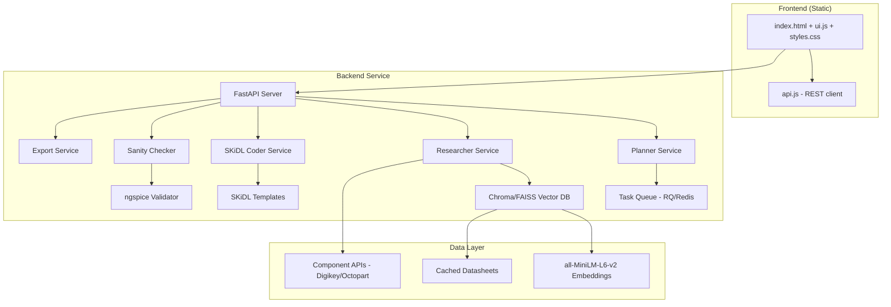

# Design Document

## Overview

VoltForge is architected as a lightweight, deterministic schematic generation system with a clear separation between a static frontend and a Python backend service. The system prioritizes speed, correctness, and open-source compatibility over AI-powered generation. The architecture follows a pipeline pattern: prompt parsing → component research → user selection → deterministic schematic generation → validation → export.

The design emphasizes minimal dependencies, fast response times, and deterministic outputs to ensure reliability and maintainability. All generation is template-based using SKiDL rather than LLM-powered to avoid hallucination and ensure electrical correctness.

## Architecture

### High-Level Architecture



### Service Architecture

The backend follows a service-oriented architecture with clear separation of concerns:

- **API Layer**: FastAPI handles HTTP requests, validation, and response formatting
- **Service Layer**: Business logic encapsulated in focused services
- **Data Layer**: Vector database for component search and caching
- **Queue Layer**: Background job processing for long-running operations

## Components and Interfaces

### Frontend Components

#### Static File Structure
```
/frontend
  index.html          # Single-page application entry point
  /src
    ui.js            # DOM manipulation and user interactions (≤15KB gzipped)
    api.js           # REST API client with error handling
    styles.css       # Inline critical CSS for performance
  /tests
    ui.test.js       # Minimal DOM testing
```

#### UI Component Responsibilities
- **Prompt Input**: Text area with validation and submission
- **Shortlist Display**: Component candidate presentation with selection controls
- **SVG Preview**: Inline schematic rendering from server-generated SVG
- **Warning Display**: Validation warnings and error messages
- **Export Controls**: Download triggers for KiCad projects

### Backend Services

#### API Endpoints Interface
```python
# Core API contract
POST /api/v1/project
GET /api/v1/project/{id}/shortlist  
POST /api/v1/project/{id}/select
GET /api/v1/job/{job_id}
GET /api/v1/project/{id}/export?format=kicad
```

#### Service Interfaces

**Planner Service**
```python
class PlannerService:
    def parse_prompt(self, prompt: str) -> ParsedPrompt:
        """Extract roles and constraints using regex + small classifier"""
        
    def extract_roles(self, prompt: str) -> Dict[str, str]:
        """Identify microcontroller, sensor, power components"""
        
    def extract_constraints(self, prompt: str) -> Dict[str, Any]:
        """Parse voltage, size, battery requirements"""
```

**Researcher Service**
```python
class ResearcherService:
    def search_components(self, role: str, constraints: Dict) -> List[Component]:
        """Query vector DB for relevant components"""
        
    def fallback_search(self, role: str) -> List[Component]:
        """Query external APIs when local search fails"""
        
    def cache_datasheet(self, component: Component) -> None:
        """Download and index component datasheets"""
```

**SKiDL Coder Service**
```python
class SKiDLCoderService:
    def generate_schematic(self, selections: Dict[str, str]) -> SchematicResult:
        """Convert component selections to SKiDL netlist"""
        
    def apply_template(self, component_type: str, component: Component) -> SKiDLObject:
        """Map component to SKiDL template"""
        
    def generate_kicad_sexpr(self, netlist: SKiDLNetlist) -> str:
        """Convert SKiDL to KiCad S-expression format"""
```

## Data Models

### Core Domain Models

```python
@dataclass
class ParsedPrompt:
    project_name: str
    roles: Dict[str, str]  # {"microcontroller": "ESP32", "sensor": "temperature"}
    constraints: Dict[str, Any]  # {"max_voltage": 5, "min_battery": "LiPo"}

@dataclass  
class Component:
    mpn: str  # Manufacturer Part Number
    manufacturer: str
    description: str
    datasheet_url: str
    datasheet_ref: str  # Local cached reference
    pins: Dict[str, str]  # Pin mapping
    electrical_specs: Dict[str, Any]
    
@dataclass
class SchematicResult:
    svg_preview: str
    kicad_sexpr: str
    netlist: str
    warnings: List[str]
    bom: List[Component]

@dataclass
class Project:
    id: str
    name: str
    prompt: ParsedPrompt
    shortlist: Dict[str, List[Component]]
    selections: Dict[str, str]
    schematic: Optional[SchematicResult]
    status: ProjectStatus
```

### Database Schema

**Vector Database (Chroma/FAISS)**
```python
# Component embeddings collection
{
    "id": "component_id",
    "embedding": [0.1, 0.2, ...],  # 384-dim from all-MiniLM-L6-v2
    "metadata": {
        "mpn": "ESP32-WROOM-32",
        "manufacturer": "Espressif",
        "category": "microcontroller",
        "datasheet_page": 15,
        "text_chunk": "GPIO pins can be configured..."
    }
}
```

**Cache Schema (Redis)**
```python
# API response caching
"api:digikey:search:{hash}" -> {
    "results": [...],
    "ttl": 3600,
    "cached_at": "2024-01-01T00:00:00Z"
}

# Job status tracking  
"job:{job_id}" -> {
    "status": "processing|done|error",
    "result": {...},
    "created_at": "2024-01-01T00:00:00Z"
}
```

## Error Handling

### Error Classification and Response Strategy

**Client Errors (4xx)**
- Invalid prompt format → 400 with specific validation errors
- Component not found → 404 with suggested alternatives
- Invalid component selection → 422 with constraint violations

**Server Errors (5xx)**  
- SKiDL generation failure → 500 with fallback to simpler template
- External API timeout → 503 with cached fallback
- ngspice validation error → 500 with warning bypass option

**Graceful Degradation**
- External API unavailable → Use cached components only
- ngspice unavailable → Skip advanced validation, show warning
- Vector DB unavailable → Use simple text matching fallback

### Error Response Format
```json
{
    "error": {
        "code": "COMPONENT_NOT_FOUND",
        "message": "No suitable microcontroller found for constraints",
        "details": {
            "constraints": {"max_voltage": 3.3},
            "suggestions": ["Relax voltage constraint", "Try different search terms"]
        }
    }
}
```

## Testing Strategy

### Test Architecture

**Unit Tests (≥85% coverage)**
- Pure functions in each service
- Template rendering logic
- Validation algorithms
- API endpoint contracts

**Integration Tests**
- Service interaction flows
- Database operations
- External API mocking
- File generation and validation

**End-to-End Tests (MCPs - Most Critical Paths)**
1. **MCP-1**: Happy path (prompt → shortlist → select → generate → export)
2. **MCP-2**: Fallback path (local search fails → external API → success)
3. **MCP-3**: Validation warnings (missing power → warning → user decision)
4. **MCP-4**: Edit loop (change selection → regenerate → updated preview)
5. **MCP-5**: Export validation (generate → export → KiCad compatibility check)

### Mock Component Providers (MCP Mocks)
```python
# Deterministic test data for Playwright
class MockComponentProvider:
    def get_esp32_variants(self) -> List[Component]:
        """Returns consistent ESP32 test data"""
        
    def get_temperature_sensors(self) -> List[Component]:
        """Returns TMP117, DS18B20, etc. test data"""
        
    def simulate_api_timeout(self) -> None:
        """Test error handling paths"""
```

### Performance Testing
- Load testing for API endpoints (target: 95th percentile ≤ 150ms)
- Frontend bundle size validation (≤ 50KB gzipped)
- Cold start performance (≤ 1s page load)
- Memory usage profiling for vector operations

## Security Considerations

### Input Validation and Sanitization
- **Prompt sanitization**: Strip HTML, limit length, escape special characters
- **SVG sanitization**: Server-side SVG cleaning to remove scripts and malicious content
- **File upload validation**: Restrict file types, scan for malware signatures
- **API rate limiting**: Per-IP request throttling to prevent abuse

### Data Protection
- **No sensitive data storage**: Avoid storing user personal information
- **Datasheet compliance**: Respect copyright and ToS for cached datasheets  
- **Secure secrets management**: Environment variables for API keys, no hardcoded credentials
- **HTTPS enforcement**: All API communication over encrypted channels

### Access Control
- **API authentication**: Optional API key for external component lookups
- **CORS configuration**: Restrict cross-origin requests to known domains
- **Input size limits**: Prevent DoS through large payload attacks
- **Resource quotas**: Limit concurrent jobs per user/IP

This design provides a solid foundation for the VoltForge MVP while maintaining the strict performance, security, and architectural requirements outlined in the PRD.